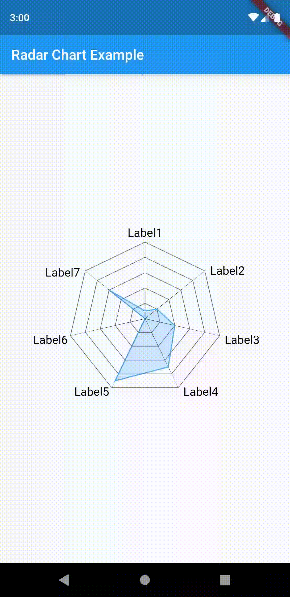
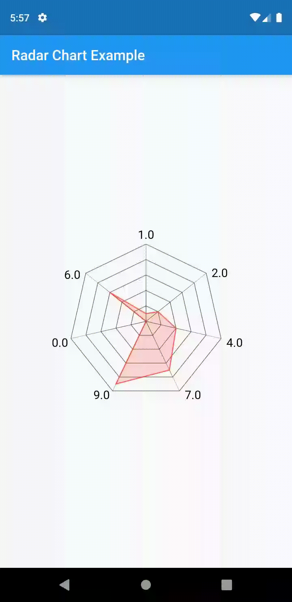

# multi_charts

It is a library that provides different types of charts to plot data points. Currently it supports only Radar Chart, but will support more types in the coming future.

## Radar Chart

 A chart which plots the values in the form of a spider web or radar. It takes the
 @required **values** parameter which provides the data points and @required **maxValue**
 which defines the scale of the graph. E.g. The chart contains five levels, if
 **maxValue**=10, then each level will have the value '2'.

 The other parameters are optional which define different behaviours for the chart like:
 
 * **labels** - which will be shown in the graph, if not provided, will default to the value
 of data points.

 * **size** - which defines the canvas area defaults to Size.infinite and is constrained by
 the parent widget.

 * **fillColor** - defines the background color of the plotted graph, if not provided, 
 defaults to **Colors.black26**.

 * **strokeColor** - defines the color of the chart outlines, defaults to **Colors.black87**.

 * **maxHeight** and **maxWidth** - defines the maximum width and height of the chart when
 no parent contraints are applied, otherwise ignored.

 * **textScaleFactor** - defines the factor by which the label's textSize should increase, 
 if not provided defaults to 0.04

 * **labelWidth** - defines the maximum width of the labels, if not provided, defaults to
 internally calculated values based on the size of the chart.

 * **maxLinesForLabels** - defines the maximum lines for the label's text, if not provided, 
 defaults to the hundredth part of the container height of the parent container.
 E.g.if height of the parent is 200, the **maxLinesForLabels**=2

 * **animate** - defines the animation toggle, if true, the chart will animate, else not.
 Defaults to true.

 * **animationDuration** - defines the duration of the animation for the graph. If not provided, 
 defaults to 1500 milliseconds.

 * **curve** - defines the animation's progress in a non-linear fashion.

### Screenshot

{:height="400px" width="200px"}
{:height="400px" width="200px"}

